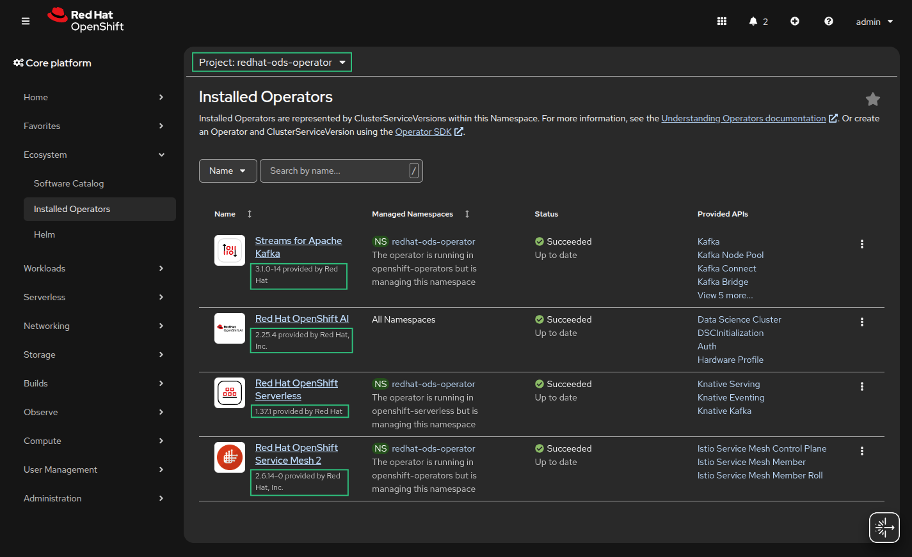
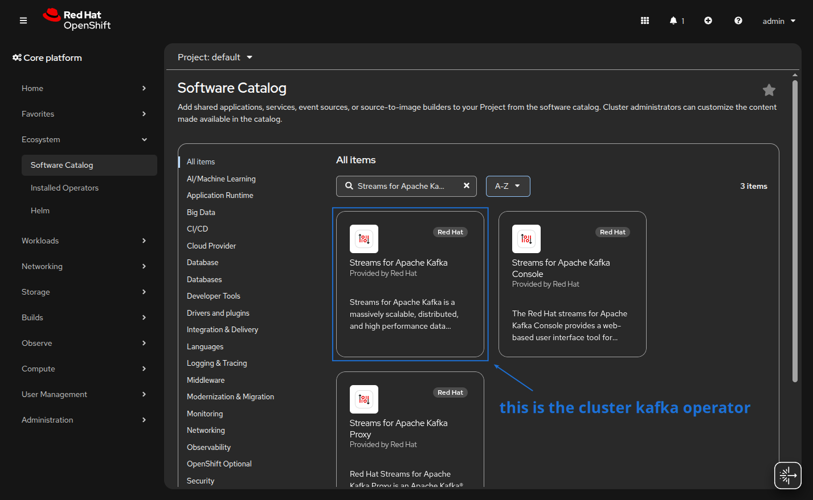
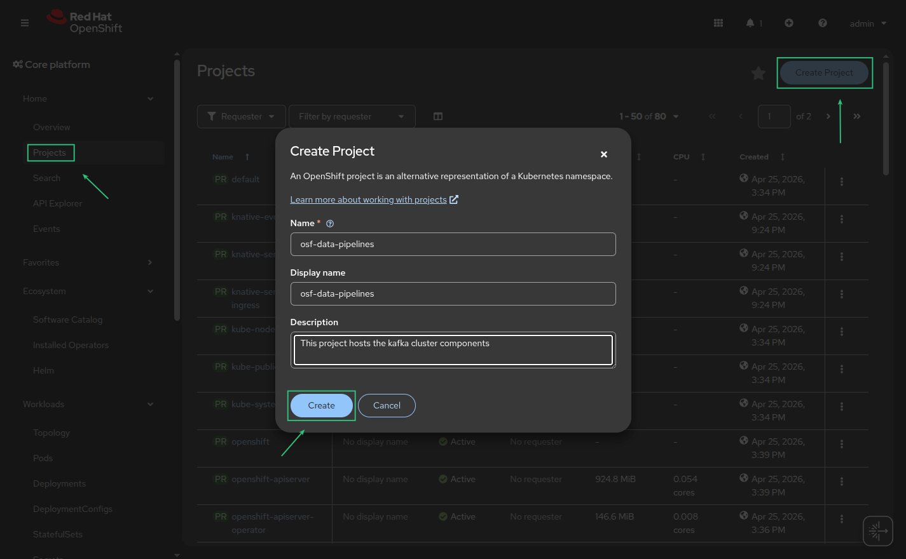
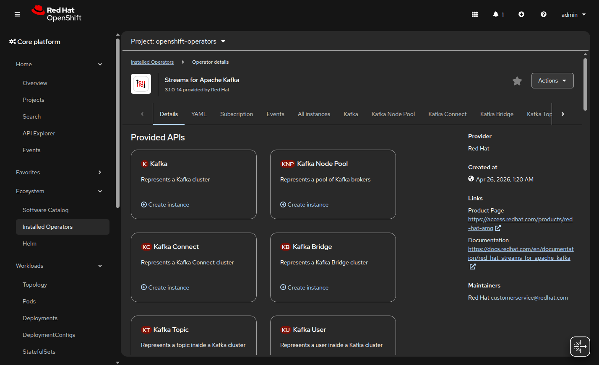
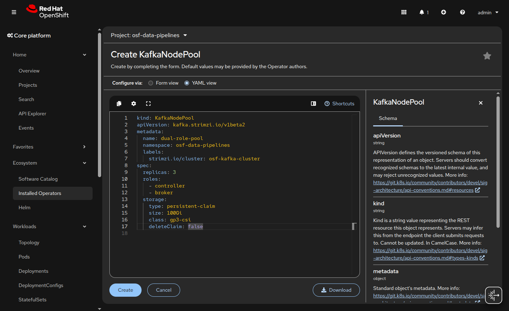
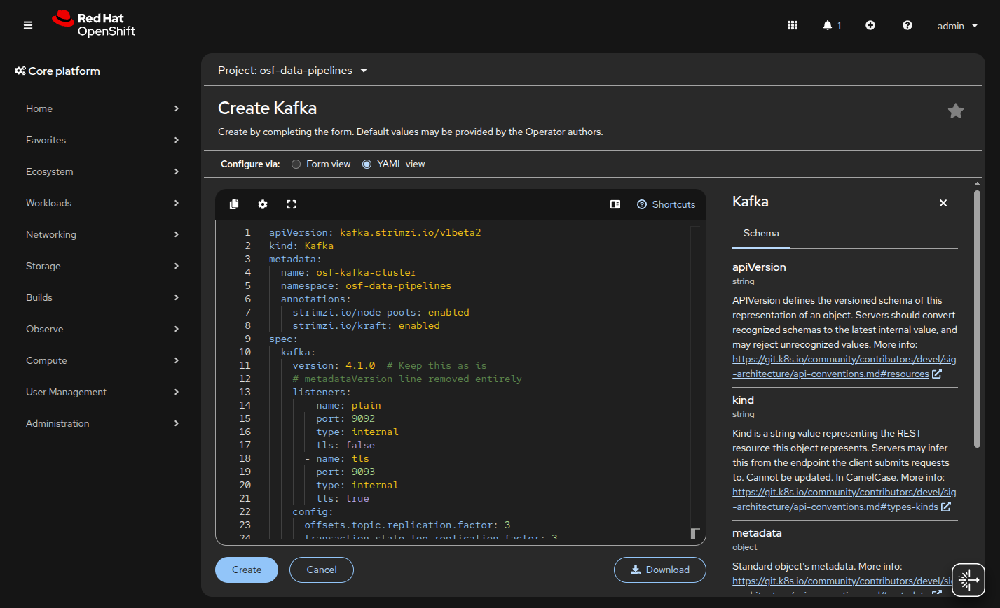

# Openshift AI Data Engineering
## Excutive Summary
This is workshop to deploy a data engineering in Openshift AI

## Scope

* [Create](https://docs.gitlab.com/user/project/repository/web_editor/#create-a-file) or [upload](https://docs.gitlab.com/user/project/repository/web_editor/#upload-a-file) files

## Architecture

DRAW

## Software Requirements

* Openshift Cluster Platform 4.21.8
* Openshift Operators
  - Red Hat OpenShift AI
  - Red Hat OpenShift Serverless
  - Red Hat OpenShift Service Mesh
 
  

## Used Infrastructure 

- Control Plane

  - Nodes: 3 x Master Nodes (Standard for HA).

  - Instance Type: m6i.xlarge (4 vCPU / 16GB RAM).

  - Storage: 100GB Root EBS volume per node.

- Compute Plane

  - Nodes: 3 x Worker Nodes
  
  - Instance Type: m6i.xlarge (8 vCPU / 32GB RAM).

  - Storage: 100GB Root EBS volume per node.


- Application Subsystems
  
| Component | Estimated Resource Draw | Source / Reference |
| :--- | :--- | :--- |
| **RHOAI Operators** | ~2 vCPU / 8GB RAM (Idle) | Platform Overhead |
| **Kafka (AMQ Streams)** | ~2 vCPU / 8GB RAM (3 Brokers) | Persistent storage required |
| **Spark Driver** | 4GB RAM (Single instance) | Spec: `spark.driver.memory: 4g` |
| **Spark Executors** | 4 Instances (~2 vCPU / 8GB RAM each) | Spec: `spark.executor.instances: 4` |
| **Jupyter Workbenches** | ~1 vCPU / 2GB RAM per active user | Standard user allocation |

## Phase 1

## Real-Time Ingestion Layer Setup

Before the data can be processed, it must establish the real-time ingestion layer using **Red Hat AMQ Streams**.

1. **Deploy the Operator**
   Install the **Streams for Apache Kafka** (top left) which is the Cluster Operator. It is the foundation for managing the Kafka brokers, topics, and users.



2. **Provision the Kafka Cluster**
   Define a Kafka custom resource to manage brokers, topics, and users as native OpenShift resources. 
   
   2.1 **Create Project**

   Project Name: osf-data-pipelines



   Before creating any instances, ensure you are in the correct project. The architectural plan specifies **osf-data-pipelines** for data-related workloads. In the top-left dropdown of your OpenShift console, switch from openshift-operators to osf-data-pipelines.

3. **Create Initial Topics**
   Following the implementation plan, it must now define a Kafka custom resource to provision the cluster brokers with persistent storage. Create the `raw-data` and `etl-input` topics to ensure producers and consumers can operate correctly.

   **Kafka Instance Configuration**

   

   1. **Create Kafka Node Pool** (Current namespace only)

   ```yaml
   kind: KafkaNodePool
   apiVersion: kafka.strimzi.io/v1beta2
   metadata:
     name: dual-role-pool
     namespace: osf-data-pipelines
     labels:
       strimzi.io/cluster: osf-kafka-cluster
   spec:
     replicas: 3
     roles:
       - controller
       - broker
     storage:
       type: persistent-claim
       size: 100Gi
       class: gp3-csi
       deleteClaim: false
   ```
   

   2. **Click Create Instance** on the Kafka tile.
   ```yaml
   apiVersion: kafka.strimzi.io/v1beta2
   kind: Kafka
   metadata:
     name: osf-kafka-cluster
     namespace: osf-data-pipelines
     annotations:
       strimzi.io/node-pools: enabled
       strimzi.io/kraft: enabled
   spec:
     kafka:
       version: 4.1.0  # Keep this as is
       # metadataVersion line removed entirely
       listeners:
         - name: plain
           port: 9092
           type: internal
           tls: false
         - name: tls
           port: 9093
           type: internal
           tls: true
       config:
         offsets.topic.replication.factor: 3
         transaction.state.log.replication.factor: 3
         transaction.state.log.min.isr: 2
         default.replication.factor: 3
         min.insync.replicas: 2
     entityOperator:
       topicOperator: {}
       userOperator: {}
   ```
   

   2. **Select the YAML view** to ensure the configuration matches your requirements for persistence and listeners.

   3. **Use the following baseline configuration**, which aligns with the "Red Hat Way" for a reliable ingestion layer:

4. **Configure CDC**
   Deploy a Kafka Connect instance (e.g., Debezium) to ingest Change Data Capture events from external databases directly into your Kafka topics.


===

## Test and Deploy

Use the built-in continuous integration in GitLab.

* [Get started with GitLab CI/CD](https://docs.gitlab.com/ci/quick_start/)
* [Analyze your code for known vulnerabilities with Static Application Security Testing (SAST)](https://docs.gitlab.com/user/application_security/sast/)
* [Deploy to Kubernetes, Amazon EC2, or Amazon ECS using Auto Deploy](https://docs.gitlab.com/topics/autodevops/requirements/)
* [Use pull-based deployments for improved Kubernetes management](https://docs.gitlab.com/user/clusters/agent/)
* [Set up protected environments](https://docs.gitlab.com/ci/environments/protected_environments/)

***

# Editing this README

When you're ready to make this README your own, just edit this file and use the handy template below (or feel free to structure it however you want - this is just a starting point!). Thanks to [makeareadme.com](https://www.makeareadme.com/) for this template.

## Suggestions for a good README

Every project is different, so consider which of these sections apply to yours. The sections used in the template are suggestions for most open source projects. Also keep in mind that while a README can be too long and detailed, too long is better than too short. If you think your README is too long, consider utilizing another form of documentation rather than cutting out information.

## Name
Choose a self-explaining name for your project.

## Description
Let people know what your project can do specifically. Provide context and add a link to any reference visitors might be unfamiliar with. A list of Features or a Background subsection can also be added here. If there are alternatives to your project, this is a good place to list differentiating factors.

## Badges
On some READMEs, you may see small images that convey metadata, such as whether or not all the tests are passing for the project. You can use Shields to add some to your README. Many services also have instructions for adding a badge.

## Visuals
Depending on what you are making, it can be a good idea to include screenshots or even a video (you'll frequently see GIFs rather than actual videos). Tools like ttygif can help, but check out Asciinema for a more sophisticated method.

## Installation
Within a particular ecosystem, there may be a common way of installing things, such as using Yarn, NuGet, or Homebrew. However, consider the possibility that whoever is reading your README is a novice and would like more guidance. Listing specific steps helps remove ambiguity and gets people to using your project as quickly as possible. If it only runs in a specific context like a particular programming language version or operating system or has dependencies that have to be installed manually, also add a Requirements subsection.

## Usage
Use examples liberally, and show the expected output if you can. It's helpful to have inline the smallest example of usage that you can demonstrate, while providing links to more sophisticated examples if they are too long to reasonably include in the README.

## Support
Tell people where they can go to for help. It can be any combination of an issue tracker, a chat room, an email address, etc.

## Roadmap
If you have ideas for releases in the future, it is a good idea to list them in the README.

## Contributing
State if you are open to contributions and what your requirements are for accepting them.

For people who want to make changes to your project, it's helpful to have some documentation on how to get started. Perhaps there is a script that they should run or some environment variables that they need to set. Make these steps explicit. These instructions could also be useful to your future self.

You can also document commands to lint the code or run tests. These steps help to ensure high code quality and reduce the likelihood that the changes inadvertently break something. Having instructions for running tests is especially helpful if it requires external setup, such as starting a Selenium server for testing in a browser.

## Authors and acknowledgment
Show your appreciation to those who have contributed to the project.

## License
For open source projects, say how it is licensed.

## Project status
If you have run out of energy or time for your project, put a note at the top of the README saying that development has slowed down or stopped completely. Someone may choose to fork your project or volunteer to step in as a maintainer or owner, allowing your project to keep going. You can also make an explicit request for maintainers.
REC
