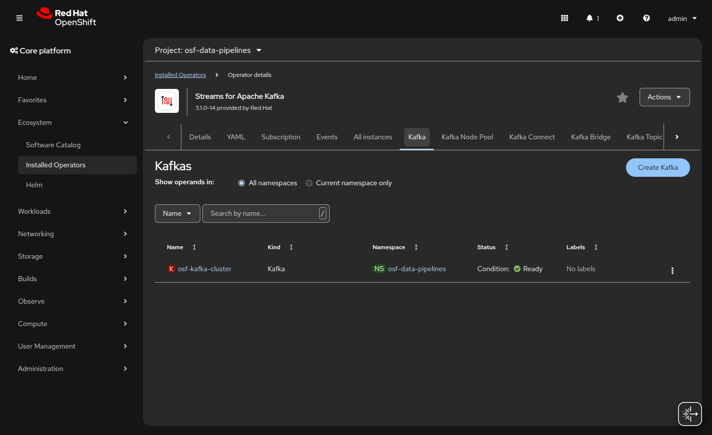
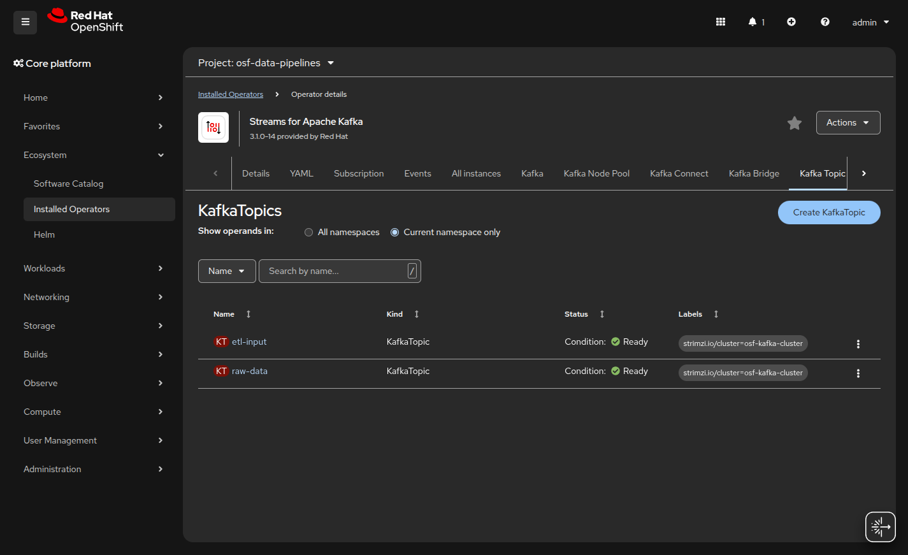
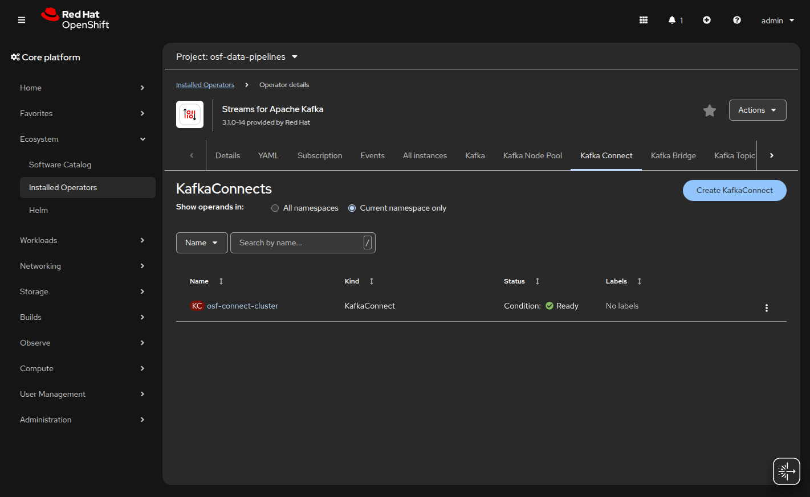

# Openshift AI Data Engineering
## Excutive Summary
This is workshop to deploy a data engineering in Openshift AI

## Scope

* [Create](https://docs.gitlab.com/user/project/repository/web_editor/#create-a-file) or [upload](https://docs.gitlab.com/user/project/repository/web_editor/#upload-a-file) files

## Architecture

DRAW

## Software Requirements

* Openshift Cluster Platform 4.21.8
* Openshift Operators
  - Red Hat OpenShift AI
  - Red Hat OpenShift Serverless
  - Red Hat OpenShift Service Mesh
 
  

## Used Infrastructure 

- Control Plane

  - Nodes: 3 x Master Nodes (Standard for HA).

  - Instance Type: m6i.xlarge (4 vCPU / 16GB RAM).

  - Storage: 100GB Root EBS volume per node.

- Compute Plane

  - Nodes: 3 x Worker Nodes
  
  - Instance Type: m6i.xlarge (8 vCPU / 32GB RAM).

  - Storage: 100GB Root EBS volume per node.


- Application Subsystems
  
| Component | Estimated Resource Draw | Source / Reference |
| :--- | :--- | :--- |
| **RHOAI Operators** | ~2 vCPU / 8GB RAM (Idle) | Platform Overhead |
| **Kafka (AMQ Streams)** | ~2 vCPU / 8GB RAM (3 Brokers) | Persistent storage required |
| **Spark Driver** | 4GB RAM (Single instance) | Spec: `spark.driver.memory: 4g` |
| **Spark Executors** | 4 Instances (~2 vCPU / 8GB RAM each) | Spec: `spark.executor.instances: 4` |
| **Jupyter Workbenches** | ~1 vCPU / 2GB RAM per active user | Standard user allocation |

## Phase 1: Real Time Ingestion Layer Setup

Before the data can be processed, it must establish the real-time ingestion layer using **Red Hat AMQ Streams**.

1. **Deploy the Operator**
   Install the **Streams for Apache Kafka** (top left) which is the Cluster Operator. It is the foundation for managing the Kafka brokers, topics, and users.


2. **Provision the Kafka Cluster**
   Define a Kafka custom resource to manage brokers, topics, and users as native OpenShift resources. 
   
   2.1 **Create Project**

   Project Name: osf-data-pipelines


   Before creating any instances, ensure you are in the correct project. The architectural plan specifies **osf-data-pipelines** for data-related workloads. In the top-left dropdown of your OpenShift console, switch from openshift-operators to osf-data-pipelines.

3. **Create Initial Topics**
   Following the implementation plan, it must now define a Kafka custom resource to provision the cluster brokers with persistent storage. Create the `raw-data` and `etl-input` topics to ensure producers and consumers can operate correctly.

   **Kafka Instance Configuration**

   

   1. **Create Kafka Node Pool** (Current namespace only)

   ```yaml
   kind: KafkaNodePool
   apiVersion: kafka.strimzi.io/v1beta2
   metadata:
     name: dual-role-pool
     namespace: osf-data-pipelines
     labels:
       strimzi.io/cluster: osf-kafka-cluster
   spec:
     replicas: 3
     roles:
       - controller
       - broker
     storage:
       type: persistent-claim
       size: 100Gi
       class: gp3-csi
       deleteClaim: false
   ```
   

   2. **Click Create Instance** on the Kafka tile.
   ```yaml
   apiVersion: kafka.strimzi.io/v1beta2
   kind: Kafka
   metadata:
     name: osf-kafka-cluster
     namespace: osf-data-pipelines
     annotations:
       strimzi.io/node-pools: enabled
       strimzi.io/kraft: enabled
   spec:
     kafka:
       version: 4.1.0
       listeners:
         - name: plain
           port: 9092
           type: internal
           tls: false
         - name: tls
           port: 9093
           type: internal
           tls: true
       config:
         offsets.topic.replication.factor: 3
         transaction.state.log.replication.factor: 3
         transaction.state.log.min.isr: 2
         default.replication.factor: 3
         min.insync.replicas: 2
     entityOperator:
       topicOperator: {}
       userOperator: {}
   ```
   

   - Expected:

   


   3. **Create topics** (Current namespace only)

   - topic: raw-data

   ```yaml
   kind: KafkaTopic
   apiVersion: kafka.strimzi.io/v1beta2
   metadata:
     name: raw-data
     labels:
       strimzi.io/cluster: osf-kafka-cluster
     namespace: osf-data-pipelines
   spec:
     partitions: 3
     replicas: 3
     config:
       retention.ms: 7200000
       segment.bytes: 1073741824
   ```

   - topic: etl

   ```yaml
   kind: KafkaTopic
   apiVersion: kafka.strimzi.io/v1beta2
   metadata:
     name: etl-input
     labels:
       strimzi.io/cluster: osf-kafka-cluster
     namespace: osf-data-pipelines
   spec:
     partitions: 3
     replicas: 3
     config:
       retention.ms: 7200000
       segment.bytes: 1073741824
   ```
   - Expected:

   

4. **Configure CDC**
   Deploy a Kafka Connect instance (e.g., Debezium) to ingest Change Data Capture events from external databases directly into your Kafka topics.

   ```yaml
   kind: KafkaConnect
   apiVersion: kafka.strimzi.io/v1beta2
   metadata:
     name: osf-connect-cluster
     namespace: osf-data-pipelines
     annotations:
       strimzi.io/use-connector-resources: "true" # Enables managing connectors via YAML
   spec:
     version: 4.1.0
     replicas: 1
     bootstrapServers: osf-kafka-cluster-kafka-bootstrap:9092
     config:
       group.id: connect-cluster
       offset.storage.topic: connect-cluster-offsets
       config.storage.topic: connect-cluster-configs
       status.storage.topic: connect-cluster-status
       config.storage.replication.factor: 3
       offset.storage.replication.factor: 3
       status.storage.replication.factor: 3
     # In a production scenario, you would add 'build' config here 
     # to include Debezium plugins
   ```
   - Expected:

   

## Phase 2: Platform & Storage Initialization

1. Create a Data Science Project: Instead of just a namespace, we create a RHOAI Project (which maps to your osf-data-pipelines namespace) to enable the visual tools like Elyra.

2. Initialize the Pipeline Server: This requires an S3-compatible bucket to store the metadata and artifacts your pipeline will produce


===

## Test and Deploy

Use the built-in continuous integration in GitLab.

* [Get started with GitLab CI/CD](https://docs.gitlab.com/ci/quick_start/)
* [Analyze your code for known vulnerabilities with Static Application Security Testing (SAST)](https://docs.gitlab.com/user/application_security/sast/)
* [Deploy to Kubernetes, Amazon EC2, or Amazon ECS using Auto Deploy](https://docs.gitlab.com/topics/autodevops/requirements/)
* [Use pull-based deployments for improved Kubernetes management](https://docs.gitlab.com/user/clusters/agent/)
* [Set up protected environments](https://docs.gitlab.com/ci/environments/protected_environments/)

***
