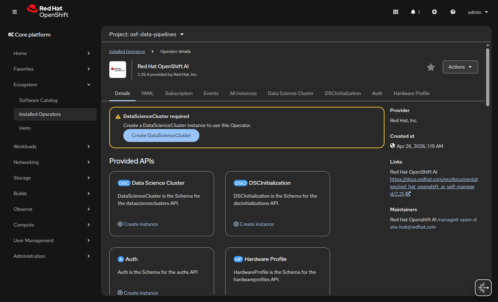
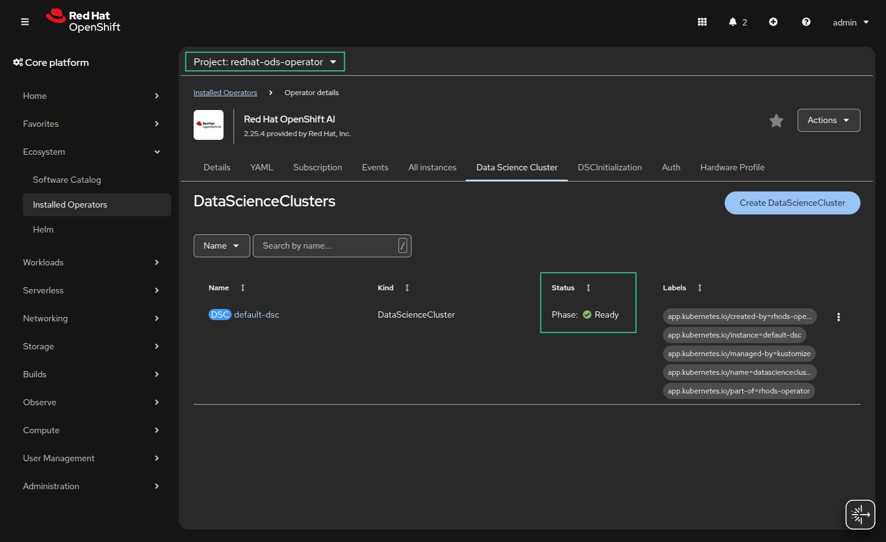

# Openshift AI Data Engineering

## Phase 2: Platform & Storage Initialization

At this stage the focus shifts from the messaging layer to the "brain" of the operation: **Red Hat OpenShift AI (RHOAI)**. Next step is to set up the environment where the Data Scientists will build their Elyra DAGs and where the Argo engine will execute them.

## Steps to get Phase 2 rolling:

#### 1. Verify the RHOAI Operator. Go to the OpenShift Web Console.

   `Navigate to Ecosystem > Installed Operators`

   Check if Red Hat OpenShift AI is installed.

   

#### 2. Initialize the AI Platform

💡 NOTE: Even if the selected project is **osf-data-pipelines**, when the DataScience Cluster is created, the resource will apply its settings cluster-wide. It doesn't "belong" to a specific project; it tells the Red Hat OpenShift AI Operator which components to turn on across the whole cluster.

The Operator then takes care of the "home addresses" for each component automatically:

   - The Dashboard and KServe go into redhat-ods-applications.

   - Monitoring goes into redhat-ods-monitoring.

   - Notebook Images are managed in rhods-notebooks.

   1. Click on the **Red Hat OpenShift AI** operator tile, and look for the **Data Science Cluster** tab, and click on **Create DataScienceCluster**.

   

   2. It can keep the default name (usually `default-dsc`).

#### 💥 Crucial Step:
   In the configuration (Form or YAML), ensure the following components are set to **Managed**:

   * **dashboard:** (This puts the link in your grid).
   * **datasciencepipelines:** (Required for your automated ETL orchestration).
   * **workbenches:** (For your Jupyter/Elyra environments).
   * **distributed workloads (CodeFlare & Ray):** (Essential for your Spark processing).

  Example yaml definition
  ```yaml
  kind: DataScienceCluster
  apiVersion: datasciencecluster.opendatahub.io/v1
  metadata:
    name: default-dsc
    labels:
      app.kubernetes.io/name: datasciencecluster
      app.kubernetes.io/instance: default-dsc
      app.kubernetes.io/part-of: rhods-operator
      app.kubernetes.io/managed-by: kustomize
      app.kubernetes.io/created-by: rhods-operator
  spec:
    components:
      codeflare:
        managementState: Managed
      dashboard:
        managementState: Managed
      datasciencepipelines:
        managementState: Managed
      feastoperator:
        managementState: Removed
      kserve:
        managementState: Managed
        serving:
          ingressGateway:
            certificate:
              type: OpenshiftDefaultIngress
          managementState: Managed
          name: knative-serving
      llamastackoperator:
        managementState: Removed
      kueue:
        managementState: Managed
      modelmeshserving:
        managementState: Managed
      modelregistry:
        managementState: Managed
        registriesNamespace: rhoai-model-registries
      ray:
        managementState: Managed
      workbenches:
        managementState: Managed
      trainingoperator:
        managementState: Managed
      trustyai:
        managementState: Managed
  ```

- Expected (after ~5 min):



#### 3. Prepare your S3 Credentials
As outlined in your project requirements, Data Science Pipelines require an S3-compatible object store to save run logs and artifacts. You will need:

  - S3 Endpoint URL (e.g., AWS S3 or MinIO)

  - Access Key ID

  - Secret Access Key

  - Bucket Name (e.g., s3-data-lake-qwsd87 / Europe - Ireland - eu-west-1 ) 

#### 4. Create the Data Connection

#### 💥 Crucial Step: 
  Data Connections are strictly namespace-scoped resources. Because a Data Connection is essentially a Kubernetes Secret with specific metadata labels, it is bound by the standard security isolation of the cluster.

- Configure Data Connection in the Red Hat OpenShift AI DataScience Project

  1. Navigate to the DataScience Project via the OpenShift AI GUI, and select project **osf-data-pipelines**.

  2. Scroll down to the **Data connections** section and click **Add data connection**.

  3. Fill in the following fields:

     * **Name:** `s3-data-lake`
     * **Access key:** *(The IAM Access Key you generated)*
     * **Secret key:** *(The IAM Secret Key you generated)*
     * **Endpoint:** `https://s3.eu-west-1.amazonaws.com`* *(used in this setup)*
     * **Region:** `eu-west-1` *(used in this setup)*
     * **Bucket:** `s3-data-lake-qwsd87` *(used in this setup)*

  4. Click **Add**.

#### [NEXT => Phase 3: Processing & Distributed Workloads](phase3.md)
