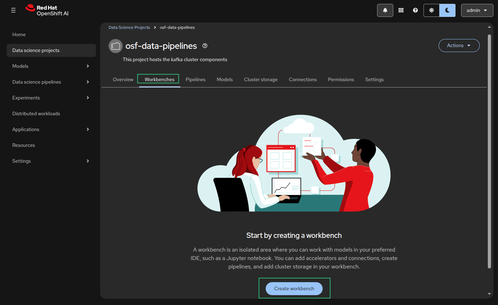
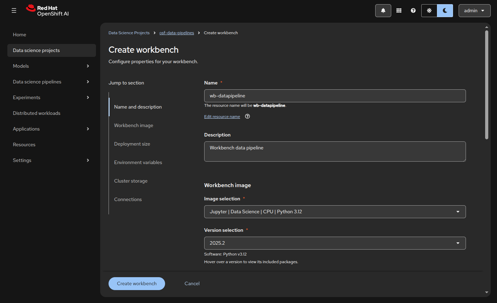
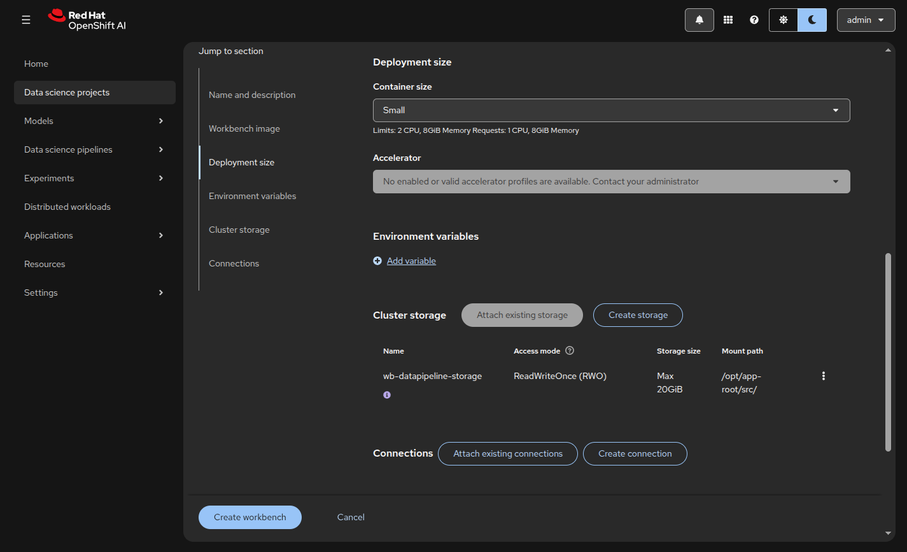
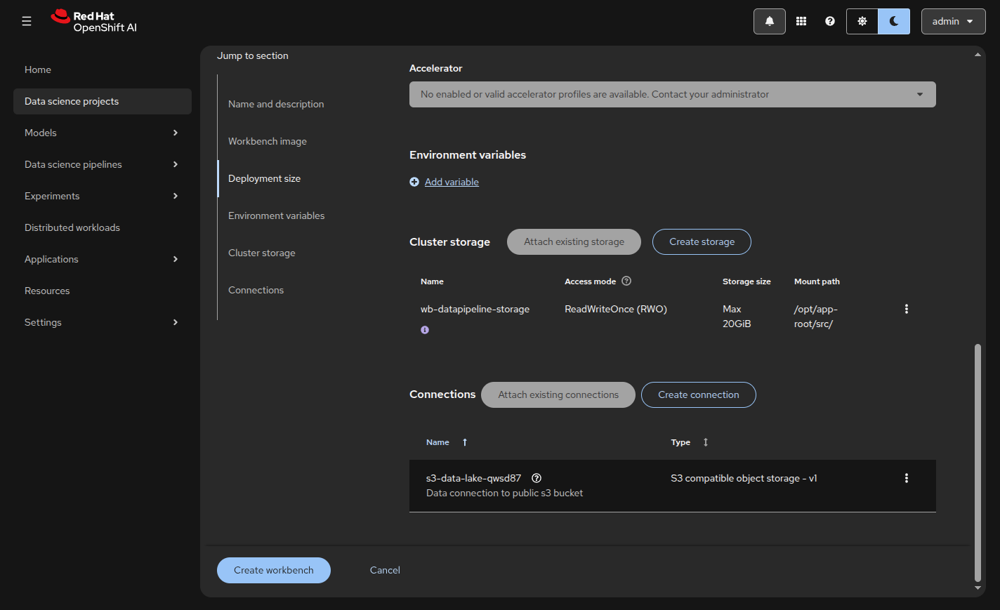
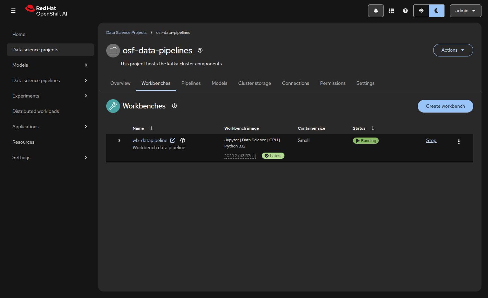
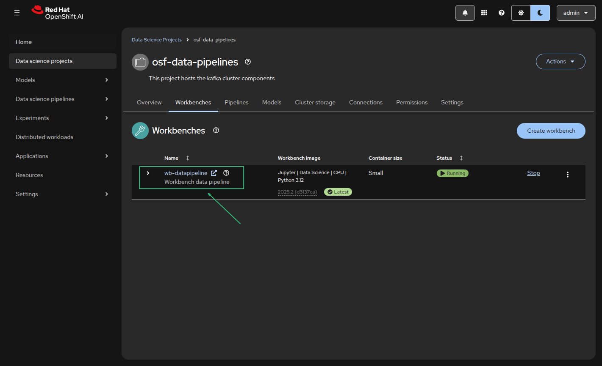
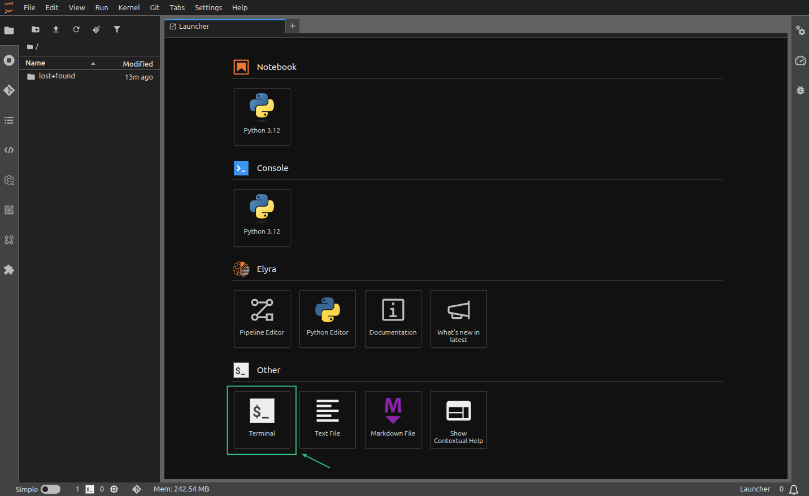
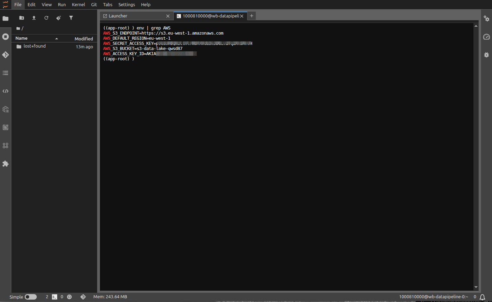

# Openshift AI Data Engineering

## Phase 3: Processing & Distributed Workloads

The objective of this phase is to provision a StatefulSet-backed Workbench within a dedicated OpenShift namespace and verify the secure injection of S3 credentials via the Data Connection mechanism. This ensures the environment is primed for S3-based ETL operations and distributed compute orchestration.

## Steps to get Phase 3 rolling:

#### 1. Workbench Provisioning

1. Navigate to the **OpenShift AI Dashboard** -> **Data Science Projects** -> `osf-data-pipelines`.
2. Select the **Workbenches** tab and click **Create workbench**.

   

3. **Image Selection:** Select the *Standard Data Science* or *PyTorch* notebook image.

   
   
   > **Note:** These images include pre-baked CLI tools like `boto3`, `oc`, and `pip`.

4. **Deployment Configuration:** * **Container Size:** Select a resource profile (e.g., *Medium: 1 CPU, 8Gi RAM*). **Persistent Storage:** Define a Persistent Volume Claim (PVC) size (minimum **20Gi** recommended for local caching).

   

5. **Data Connection Association:** * Under the **Data connections** section, select **Use existing data connection**.

   

   * Choose the connection created in Phase 2.
   
   > **Technical Note:** This triggers the Injection Logic, where the Operator maps the Secret's Data keys to the Pod’s environment variables.
 
 - Expected:

   


#### 2. Verification of Environment Variable Injection

Once the workbench status transitions to **Running**, perform a technical audit of the container environment:

1. Click **Open** to launch the JupyterLab IDE.

   
  
2. Open a **New Terminal** (`File` -> `New` -> `Terminal`).

    

3. Execute the following command to check for the injected S3 metadata:

    ```bash
    env | grep AWS
    ```
   - Expected: 

    

Success Criteria: The terminal must return the following variables, populated with the values from your S3 Secret:

  - AWS_ACCESS_KEY_ID

  - AWS_SECRET_ACCESS_KEY

  - AWS_S3_ENDPOINT

  - AWS_S3_BUCKET


#### 3. Functional Handshake Test (S3 Reachability)

    ```python
    import os, boto3

    # Initialize the S3 client using injected environment variables
    s3 = boto3.client('s3', endpoint_url=os.environ['AWS_S3_ENDPOINT'])

    # List buckets to verify connectivity
    print([bucket['Name'] for bucket in s3.list_buckets()])
    ```

#### 4. Technical Summary of Infrastructure State

At the conclusion of Phase 3, the following infrastructure components are synchronized:

  - Pod Definition: The Workbench pod is running with a volumeMount pointing to the service account token and environment variables sourced from a secretRef.

  - Security Context: The Workbench is running under a specific Service Account capable of requesting the Ray/Spark resources in the upcoming Phase 5.