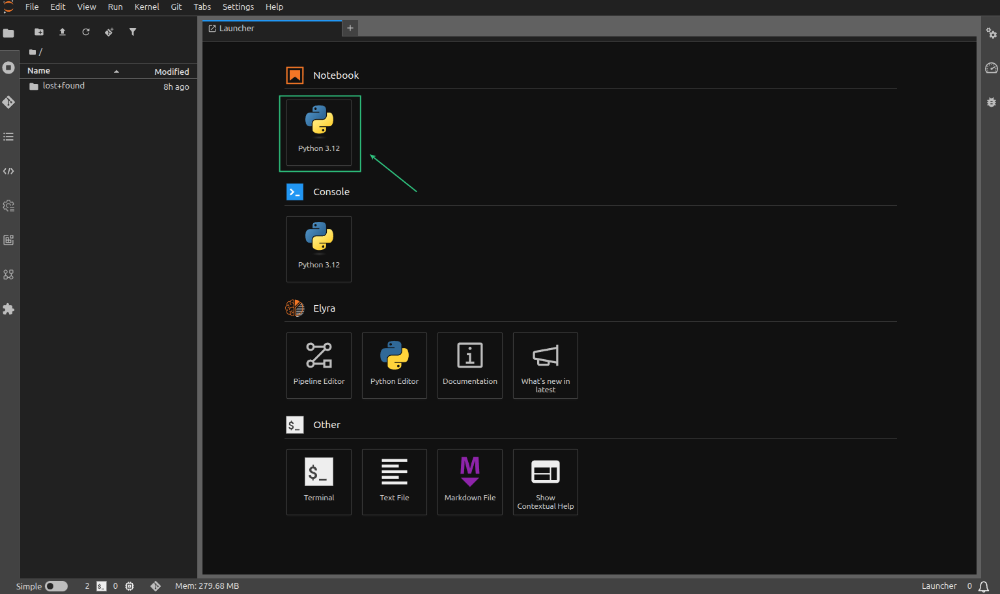

# Openshift AI Data Engineering

## Phase 4: Pipeline Orchestration (Elyra & Data Science Pipelines)

The objective of this phase is to provision a Data Science Pipeline Server within the project namespace and configure the Elyra Runtime in your Workbench. This allows you to convert Jupyter notebooks into nodes in a visual directed acyclic graph (DAG) and execute them as automated cluster jobs.

## Steps to get phase 4 rolling

#### 1. Provision the Pipeline Server

- 1.1. Navigate to the **OpenShift AI Dashboard** -> **Data Science Projects** -> `osf-data-pipelines`

- 1.2. Select the **Pipelines** tab.

- 1.3. Click **Configure pipeline server**.

  

- 1.4. **Object Storage Connection:**
   * Select **Existing data connection**.
   * Choose the connection created in Phase 2.

   
   
   > **Note:** The server will use these credentials to create a "pipeline-artifacts" folder in your bucket.

- 1.5. **Database Configuration:**
   * Select **Default database on cluster**.

   
   
     > **Technical Note:** This will automatically deploy a small MariaDB pod in your namespace to store pipeline run history and metadata.
   
- 1.6. Click **Configure pipeline server** and wait for the "Pipeline server is ready" status.

    

---

#### 2. Verify Pipeline Infrastructure Pods

- 2.1 - Once the server is created, OpenShift will spin up the orchestration backend. Run this in your terminal to verify

  ```bash
  oc get pods -n osf-data-pipelines | grep pipeline
  ```

  

- 2.2 - 💥 **Grant Pipeline Permissions**. Open your local terminal (with oc access) and run these commands to give your Workbench the edit VIP pass

  ```bash
  oc policy add-role-to-user edit -z default -n osf-data-pipelines
  oc policy add-role-to-user edit -z jupyter-notebook -n osf-data-pipelines
  oc policy add-role-to-user edit -z wb-datapipeline -n osf-data-pipelines
  ```

---

#### 3. Using pipelines as code

In this step the task is to write the Python code that defines what the pipeline does, what container images to use, and how to securely map the Kubernetes S3 Secret.

- 3.1. Open your **Workbench** (JupyterLab).

  
  
- 3.2. Pipeline python notebook

    1. Define the Pipeline Components
    ```python
    from kfp import dsl, compiler
    from kfp import kubernetes

    # Define Step 1: The container image is hardcoded for total reproducibility
    @dsl.component(
        base_image="quay.io/opendatahub/workbench-images:runtime-datascience-ubi9-python-3.11"
    )
    def data_extraction_step():
        import os
        
        # The code looks for environment variables (which we will inject securely later)
        access_key = os.environ.get('AWS_ACCESS_KEY_ID')
        secret_key = os.environ.get('AWS_SECRET_ACCESS_KEY')
        
        if access_key and secret_key:
            print("SUCCESS! Secure environment variables are loaded!")
            print(f"Connecting to S3 with key starting in: {access_key[:4]}...")
        else:
            print("FAILED: Secrets were not mounted.")
    ```
  
---

#### 5. Technical Summary of State

At the end of phase 4:

* **Orchestration:** Your namespace is now a mini-Kubeflow environment with its own private database and API server.
* **Separation of Concerns:** You can now schedule jobs to run at 2 AM without having your Workbench open or running.

    > **Question:** Does your Pipeline Server show as "Ready" in the dashboard, or did it get stuck while deploying the MariaDB pod?


#### [NEXT => Phase 5: Unified Observability](phase5.md)