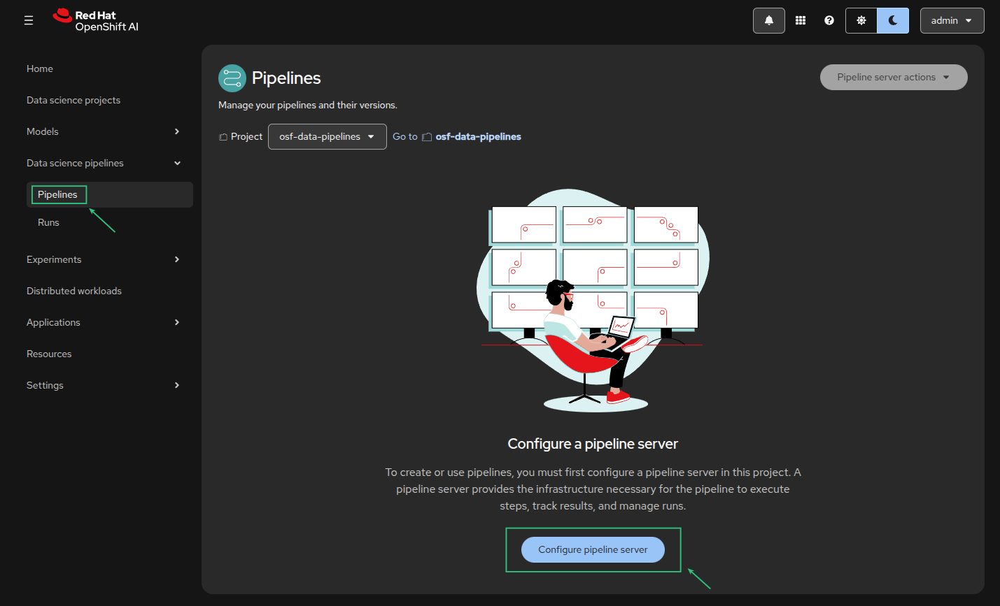
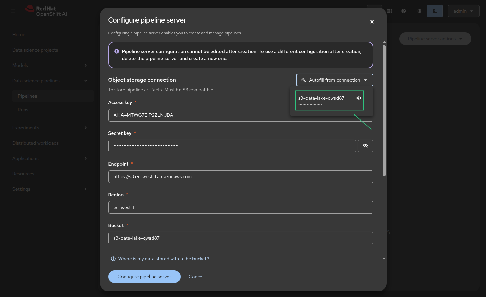
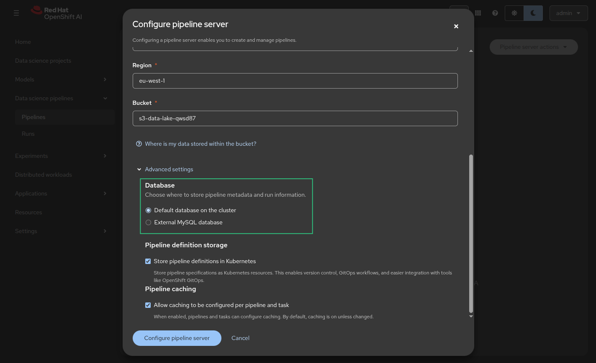
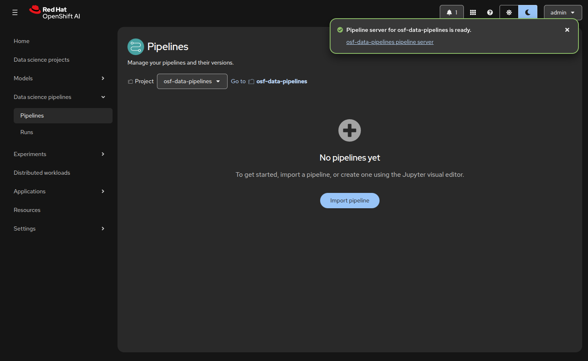
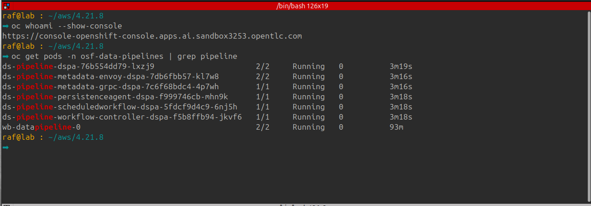

# Openshift AI Data Engineering

## Phase 4: Pipeline Orchestration (Elyra & Data Science Pipelines)

The objective of this phase is to provision a Data Science Pipeline Server within the project namespace and configure the Elyra Runtime in your Workbench. This allows you to convert Jupyter notebooks into nodes in a visual directed acyclic graph (DAG) and execute them as automated cluster jobs.

## Steps to get Phase 4 rolling:

#### 1. Provision the Pipeline Server

- 1.1. Navigate to the **OpenShift AI Dashboard** -> **Data Science Projects** -> `osf-data-pipelines`.

- 1.2. Select the **Pipelines** tab.

- 1.3. Click **Configure pipeline server**.

   

- 1.4. **Object Storage Connection:**
   * Select **Existing data connection**.
   * Choose the connection created in Phase 2.

   
   
   > **Note:** The server will use these credentials to create a "pipeline-artifacts" folder in your bucket.

- 1.5. **Database Configuration:**
   * Select **Default database on cluster**.

   
   
   > **Technical Note:** This will automatically deploy a small MariaDB pod in your namespace to store pipeline run history and metadata.
   

- 1.6. Click **Configure pipeline server** and wait for the "Pipeline server is ready" status.

    

#### 2. Verify Pipeline Infrastructure Pods

- 2.1 - Once the server is created, OpenShift will spin up the orchestration backend. Run this in your terminal to verify

  ```bash
  oc get pods -n osf-data-pipelines | grep pipeline
  ```

  

- 2.2 - 💥 **Grant Pipeline Permissions**. Open your local terminal (with oc access) and run these commands to give your Workbench the edit VIP pass

  ```bash
  oc policy add-role-to-user edit -z default -n osf-data-pipelines
  oc policy add-role-to-user edit -z jupyter-notebook -n osf-data-pipelines
  oc policy add-role-to-user edit -z wb-datapipeline -n osf-data-pipelines
  ```

#### 3. Configure the Elyra Runtime (The Workbench Handshake)

Now, the Workbench needs to know where to send its code.

  1. Open your **Workbench** (JupyterLab).
  2. On the left sidebar, click the **Runtimes**. Select/create a runtime image.
  
     2.1 - Add a Runtime Image. Elyra needs to know what containers it is allowed to use to run your code.

       - In JupyterLab, open the left sidebar and click the Runtime Images icon.

       - Click the + (plus) button.

       - Display Name: Standard Python

       - Image Name: quay.io/opendatahub/workbench-images:runtime-datascience-ubi9-python-3.11 (or any standard python image)

       - Click Save & Close.

  # HERE CREATE THE RUNTIME IMAGE PIC 
   
  3. Click the **+** (plus icon) to create a new **Pipelines** runtime (Kubeflow pipeline underneath).

     **Pipeline Runtime Configuration:** Open the left sidebar and click the Runtimes icon (the monitor icon). Click the + to add a new Data Science Pipeline runtime. Data Science Pipelines Settings:

       - Display Name: `Local-Project-Pipeline`

       - API Endpoint: The public https://ds-pipeline-dspa... URL.

       - Public API Endpoint: The exact same public https://ds-pipeline-dspa... URL.

       - User Namespace: osf-data-pipelines

       - Authentication Type: KUBERNETES_SERVICE_ACCOUNT_TOKEN

#### 4. Functional Handshake Test (The "Hello World" Pipeline)

  1. In JupyterLab, create a new **Pipeline Editor** (from the Launcher).
  2. Drag a single `.ipynb` notebook onto the canvas.
  3. Click the **Play** button (Run) in the top toolbar.
  4. Select your `Local-Project-Pipeline` runtime and hit **OK**.

  > **Next Step:** Once you trigger the run, you can go back to the OpenShift AI Dashboard under the **Pipeline Runs** tab to watch your notebook execute as a standalone container job.

#### 5. Technical Summary of State

At the end of Phase 4:

* **Orchestration:** Your namespace is now a mini-Kubeflow environment with its own private database and API server.
* **Separation of Concerns:** You can now schedule jobs to run at 2 AM without having your Workbench open or running.

> **Question:** Does your Pipeline Server show as "Ready" in the dashboard, or did it get stuck while deploying the MariaDB pod?